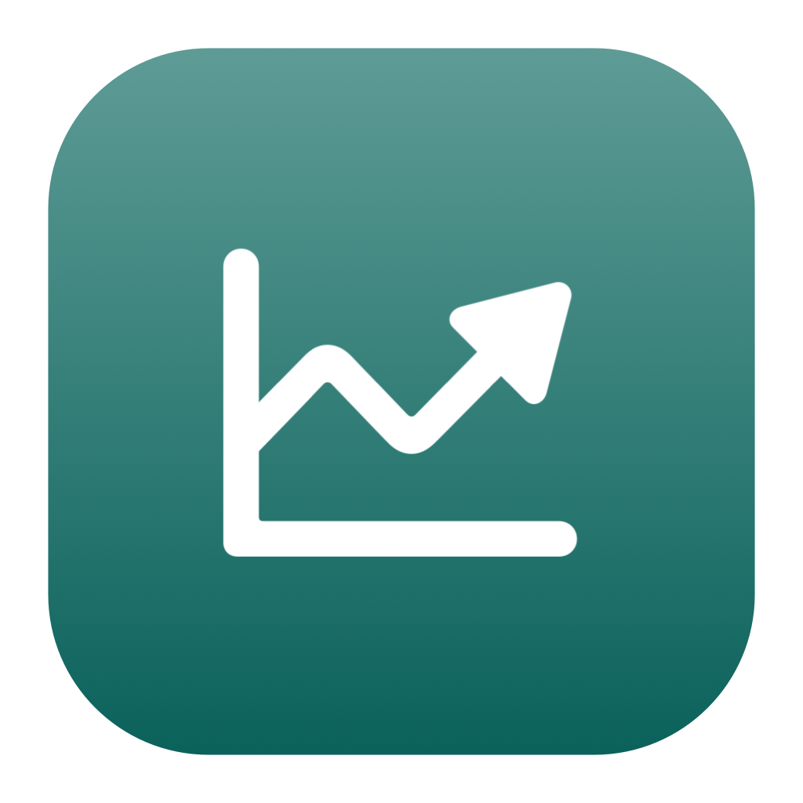
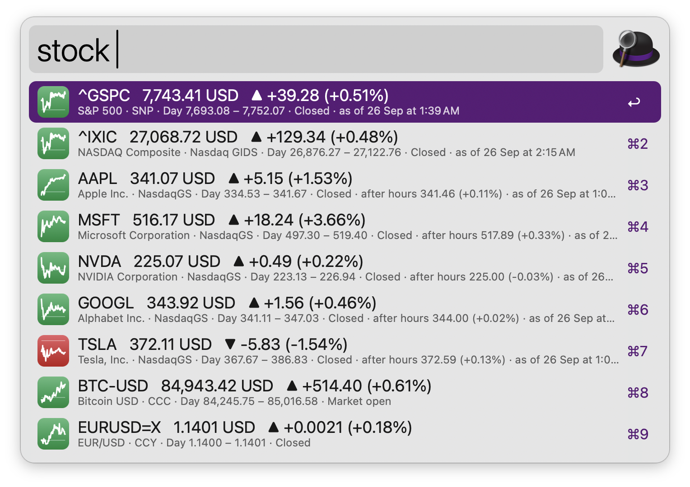
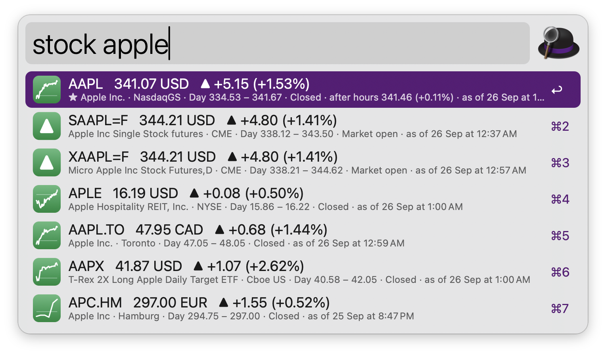
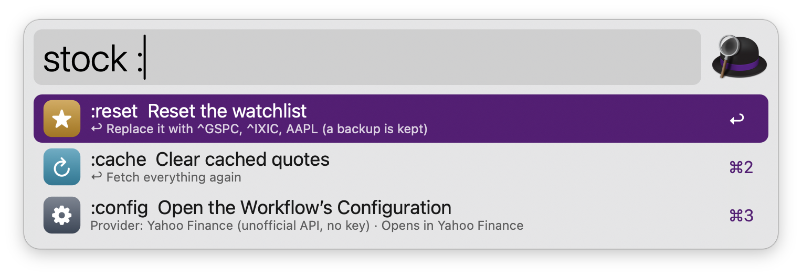

#  Stocks

Stock, index, crypto and currency quotes in Alfred, with a watchlist and intraday sparklines. No dependencies: everything runs on tools that ship with macOS.

## Usage

See your watchlist via the `stock` keyword. Each row shows the price, the change since the previous close (▲ up, ▼ down), the day range and whether the market is open, with the day’s chart as its icon. Quotes appear instantly from the cache and refresh in the background.



Look up a stock, index, cryptocurrency or currency pair by ticker or company name, like `apple`, `^GSPC`, `BTC-USD` or `EURUSD=X`, via the `stock` keyword.



Alternatively, look up selected text via the Universal Action.

* <kbd>↩</kbd> Open the quote in Yahoo Finance, Google Finance, TradingView or the Stocks app, as set in the Workflow’s Configuration.
* <kbd>⌘</kbd><kbd>↩</kbd> Copy the price.
* <kbd>⌥</kbd><kbd>↩</kbd> Add to or remove from the watchlist.
* <kbd>⌃</kbd><kbd>↩</kbd> Move to the top of the watchlist.
* <kbd>⌘</kbd><kbd>Y</kbd> Quick Look the quote page.
* <kbd>⌘</kbd><kbd>L</kbd> Show the quote in Large Type.

Reset the watchlist (`:reset`), clear cached quotes (`:cache`) or open the Workflow’s Configuration (`:config`) by typing `:` via the `stock` keyword.



### Data providers

Yahoo Finance is used by default and needs no account. Its API is unofficial and can change or block requests without notice (that is how the older Alfred stock workflows broke), so the workflow tells you when a provider fails. Pick Finnhub, Twelve Data or Alpha Vantage in the Workflow’s Configuration instead, then save a free API key with `:key` followed by the key via the `stock` keyword. Keys are stored in the macOS Keychain.

Symbols follow each provider’s conventions: Yahoo Finance uses `^GSPC`, `BTC-USD`, `EURUSD=X` and exchange suffixes like `7203.T`; Finnhub uses `BINANCE:BTCUSDT`; Twelve Data uses `BTC/USD` and `EUR/USD`. Sparklines are drawn for Yahoo Finance quotes only. The free plans of the keyed providers mostly cover US markets and have tight limits (Alpha Vantage allows 25 requests a day).

Quotes may be delayed and are for information only: this is not financial advice, and the workflow can’t trade.

Every keyword can be changed in the Workflow’s Configuration.

## Development

```bash
swift tools/make_icons.swift tools/icons.json src   # regenerate icons
python3 tools/build.py --package                     # write src/info.plist and dist/*.alfredworkflow
python3 tests/test_stocks.py                         # run the tests (offline, against fixtures)
STOCKS_LIVE=1 python3 tests/test_stocks.py LiveTests # optional smoke test against Yahoo Finance
python3 tools/capture_fixtures.py                    # re-capture tests/fixtures from the real APIs
```

## AI disclosure

This workflow was developed with the help of Claude (Anthropic), an AI assistant. The code is reviewed and tested by the author.
